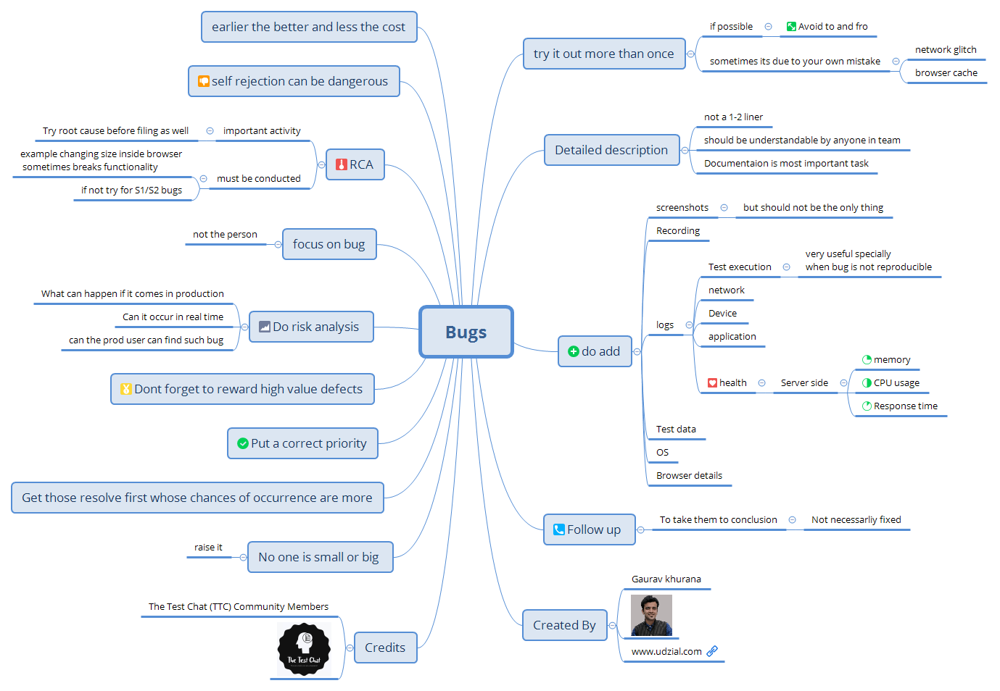

import YouTubeEmbed from '@site/src/components/YouTubeEmbed';

# Bug Reporting Best Practices in Software Testing

Master the art of effective bug reporting with proven strategies from industry experts. Learn how to write detailed bug reports that save time and improve software quality.

<YouTubeEmbed 
  videoId="AOlL6hCE2ds" 
  title="Bugs in Software Testing - Complete Guide" 
/>

## Essential Tips for Bug Reporting Excellence

[Explore the HTML version for enhanced visual experience](https://htmlpreview.github.io/?https://raw.githubusercontent.com/gauravkhuraana/Testing/main/Bugs/Bugs.html)

### Professional Insights on Bug Testing - [bit.ly/testing_bugs](https://bit.ly/testing_bugs)
*This is a short way to remember the video on this page*

---

## Bug Testing Fundamentals

### 1. Reproduce the Issue Multiple Times

Before reporting any bug, ensure you can consistently reproduce it:

- **Verify Reproducibility**: Test the scenario at least 2-3 times
- **Avoid Back-and-Forth**: Reduce unnecessary communication with developers
- **Rule Out External Factors**:
  - Network connectivity issues
  - Browser cache problems
  - User error or misunderstanding

### 2. Write Comprehensive Bug Descriptions

Effective bug reports require detailed documentation:

- **Avoid One-Liners**: Write clear, comprehensive descriptions
- **Team Accessibility**: Ensure anyone on the team can understand the issue
- **Documentation Priority**: Treat bug documentation as a critical task

### 3. Include Essential Supporting Materials

#### Screenshots and Visual Evidence
- **Capture Context**: Include relevant UI elements and error states
- **Supplement, Don't Replace**: Screenshots should enhance, not substitute text descriptions

#### Screen Recordings
- **Show User Flow**: Demonstrate the exact steps leading to the bug
- **Highlight Interactions**: Make mouse clicks and keyboard inputs visible

#### Comprehensive Logs

##### Test Execution Logs
- **Critical for Non-Reproducible Bugs**: Essential when issues can't be consistently reproduced
- **Include Test Steps**: Document each action performed during testing

##### System Information
- **Network Logs**: Capture API calls and network responses
- **Device Details**: Document hardware specifications and configurations
- **Application Logs**: Include relevant error messages and stack traces

##### Performance Metrics
- **Server-Side Monitoring**:
  - Memory usage statistics
  - CPU utilization data
  - Response time measurements

#### Test Environment Details

##### Test Data
- **Input Values**: Document exact data used during testing
- **Data Dependencies**: Note any prerequisite data or system states

##### System Configuration
- **Operating System**: Version and build information
- **Browser Details**: Version, extensions, and configuration settings

### 4. Maintain Effective Follow-Up

- **Track to Resolution**: Monitor bug progress until conclusion
- **Understand Outcomes**: Not all bugs require fixes - some may be documented as known limitations

### 5. Apply Cost-Benefit Analysis

- **Early Detection**: Identify bugs early in the development cycle to reduce fix costs
- **Avoid Self-Rejection**: Don't dismiss potential issues without proper investigation

### 6. Conduct Root Cause Analysis (RCA)

#### Pre-Filing Investigation
- **Initial Analysis**: Investigate potential causes before reporting
- **Environment Factors**: Consider browser settings, screen resolution, or device-specific issues

#### Post-Discovery Analysis
- **Critical Bugs**: Mandatory for high-severity issues (S1/S2)
- **Functionality Impact**: Assess whether fixes might affect other features

### 7. Professional Communication Standards

- **Focus on Issues**: Address the technical problem, not individuals
- **Constructive Approach**: Maintain professional tone in all communications

### 8. Risk Assessment and Prioritization

#### Production Impact Analysis
- **Real-World Scenarios**: Evaluate likelihood of user encounters
- **Business Impact**: Assess potential consequences in production environment
- **User Experience**: Consider impact on end-user workflows

#### Priority Management
- **Risk-Based Prioritization**: Address high-probability issues first
- **Occurrence Likelihood**: Prioritize bugs users are most likely to encounter

### 9. Quality Recognition and Team Culture

- **Value High-Impact Discoveries**: Acknowledge testers who identify critical issues
- **Encourage Reporting**: Create a culture where all team members feel comfortable reporting bugs
- **No Hierarchy in Quality**: Every team member's observations are valuable

## Connect and Learn More

Stay updated with the latest testing insights and automation strategies:

- **YouTube Channel**: [Subscribe for testing tutorials and tips](https://www.youtube.com/@gauravkhurana)
- **Medium Articles**: [Read in-depth testing guides](https://medium.com/@gauravkhurana)
- **1:1 Mentoring**: [Book a session on Topmate](https://topmate.io/gauravkhurana)
- **Professional Website**: [www.udzial.com](https://www.udzial.com)

## Acknowledgments

Special thanks to **The Test Chat (TTC) Community Members** for their valuable contributions and insights that shaped this comprehensive guide.

---

*This guide represents collective wisdom from experienced testing professionals worldwide. Apply these practices to enhance your bug reporting skills and contribute to higher software quality.*
	
