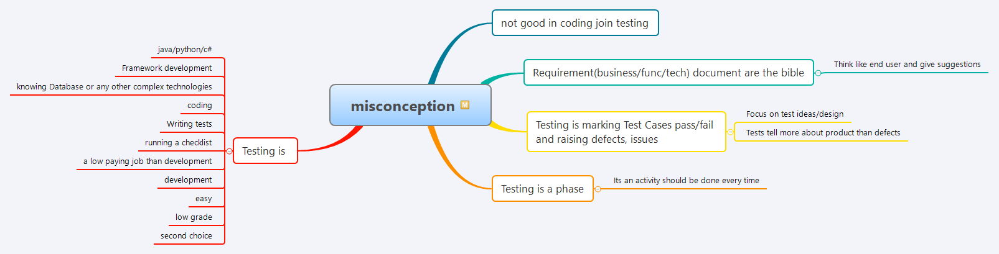

# Common Misconceptions in Software Testing

Testing is a critical part of software development, yet many misconceptions persist about what testers do and the skills required. Let's debunk these myths and understand the reality of modern software testing.

## 🎯 Quick Links

- [📺 Watch my YouTube video on Testing Misconceptions](https://youtube.com/watch?v=your-video-id)
- [📖 Read more on Medium](https://medium.com/@gauravkhuraana)
- [💬 Get personalized guidance on Topmate](https://www.topmate.io/gauravkhurana)

  <iframe 
    width="560" 
    height="315" 
    src="https://www.youtube.com/embed/your-video-id" 
    title="Testing Misconceptions Explained"
    frameBorder="0" 
    allow="accelerometer; autoplay; clipboard-write; encrypted-media; gyroscope; picture-in-picture" 
    allowFullScreen>
  </iframe>
   
  <a href="https://youtube.com/watch?v=your-video-id" target="_blank" rel="noopener noreferrer">
    <button style={{marginTop: '10px', padding: '10px 20px', backgroundColor: '#ff0000', color: 'white', border: 'none', borderRadius: '5px', cursor: 'pointer'}}>
      ▶️ Watch on YouTube
    </button>
  </a>

[Click here for the interactive HTML version](https://htmlpreview.github.io/?https://github.com/gauravkhuraana/Testing/blob/main/Misconception%20in%20Testing/misconception.html)

---

## 📋 What You'll Learn

This comprehensive guide covers the most persistent myths in software testing and helps you understand:

- Why "anyone can do testing" is completely wrong
- The technical skills modern testers actually need
- How testing fits into agile development cycles
- Career growth opportunities in QA and testing

---

## 🚫 Major Testing Misconceptions Debunked

### 1. "Not Good at Coding? Just Join Testing"

**The Myth:** Testing is an easy fallback for people who can't code.

**The Reality:** Modern testing requires strong technical skills including:
- Programming knowledge for automation frameworks
- Understanding of APIs, databases, and system architecture  
- Critical thinking and analytical problem-solving abilities
- Knowledge of testing tools and methodologies

**Pro Tip:** Successful testers often have broader technical knowledge than developers because they need to understand the entire system.

### 2. "Requirements Documents Are the Ultimate Truth"

**The Myth:** Testers should only test what's written in requirements.

**The Reality:** 
- Think like an end user and provide valuable feedback
- Requirements documents can have gaps or assumptions
- Good testers identify edge cases not covered in documentation
- User experience insights are crucial for product success

### 3. "Testing = Executing Test Cases and Reporting Bugs"

**The Myth:** Testing is just following scripts and marking pass/fail.

**The Reality:**
- Focus on test strategy and intelligent test design
- Exploratory testing reveals critical insights about product quality
- Risk assessment and test planning are core responsibilities
- Testers provide valuable feedback on usability and user experience

### 4. "Testing Is Just a Phase Before Release"

**The Myth:** Testing happens only at the end of development.

**The Reality:**
- Testing is a continuous activity throughout the development lifecycle
- Shift-left testing integrates QA from project inception
- Early testing catches issues when they're cheaper to fix
- Modern agile teams have testers involved in sprint planning and requirements review

## ❌ What Testing Is NOT

Testing is definitely not:

- **Limited to specific technologies:** Good testers adapt to various tech stacks
- **Just framework development:** While automation is important, it's one part of testing
- **Only about databases and complex tools:** Understanding the user journey matters more
- **Pure coding:** Testing combines technical and analytical skills
- **Mindless script execution:** Critical thinking and creativity are essential
- **A low-paying career:** Experienced testers and automation engineers command high salaries
- **Easier than development:** Testing requires a different but equally valuable skill set
- **A backup career option:** Successful testing requires dedication and continuous learning

## 🎯 The Truth About Modern Testing

Quality Assurance and testing roles in 2025 require:

- **Technical Skills:** Automation, API testing, CI/CD integration
- **Analytical Thinking:** Risk assessment and test strategy
- **Communication:** Collaborating with developers, product managers, and stakeholders  
- **Continuous Learning:** Staying updated with new tools and methodologies
- **Business Understanding:** Knowing how testing impacts user experience and business goals

## 🚀 Ready to Excel in Testing?

Understanding these misconceptions is the first step toward building a successful testing career. The field offers excellent growth opportunities for those who approach it with the right mindset and skills.

### Connect With Me

- 📺 [Subscribe to my YouTube channel](https://www.youtube.com/@Udzial/playlists) for testing tutorials
- 📖 [Follow me on Medium](https://www.medium.com/@gauravkhuraana) for in-depth articles  
- 💬 [Book a 1:1 session on Topmate](https://www.topmate.io/gauravkhurana) for personalized career guidance

*Remember: Testing is not about finding faults in code – it's about ensuring exceptional user experiences and robust software solutions.*
